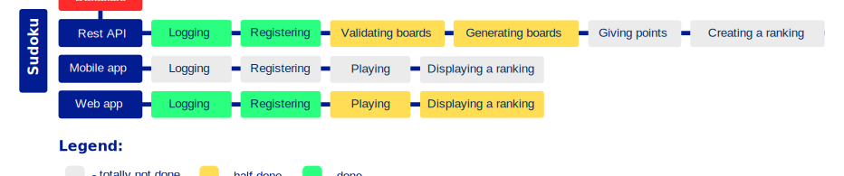
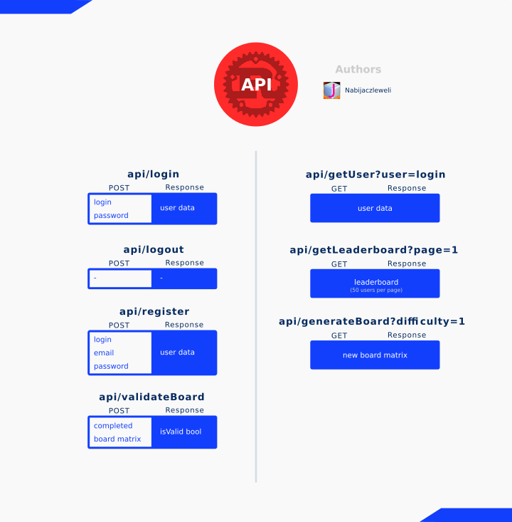

# 
A modern, API-based Sudoku app.

## Introduction

Our goal is to make the best Sudoku app on the web.

There are a lot of Sudoku games on the web, but none of them well built nor with good design.
We want to make our take modern, secure, well-designed and open to everyone – it works well on all available platforms and screens.

`Sudoku` consists of a public API, web app, and in the future – a mobile app.

# 

## API

The full API documentation is present [HERE](https://cdn.rawgit.com/Galactim/Sudoku/backend-doc/sudoku_backend/index.html)

However, here's an infographic showing its key features:

# 

After a game is won, the player is awarded points, calculated as follows:

```c
points = difficulty * (3000 / solvingDuration + 30)
```

Where `difficulty` ϵ {1, 2, 3} and `solvingDuration` is in seconds.

All endpoint data is returned in  **JSON**.

## Database

<sub>Here temporarily, subject to change and move elsewhere with rest of internal design documents.</sub>

### USERS
| id | username        | password             | email                   | created_at          | is_admin | points_total |
|----|-----------------|----------------------|-------------------------|---------------------|----------|--------------|
| 1  | CaptainNemo1870 | $rscrypt$0$EAgC$Z... | pressure@isdanger.io    | 2018-07-23 18:18:24 | 0        | 15134        |
| 2  | aw3someLand3r   | $rscrypt$0$C$LQO7... | just@readinstructions.sx | 2024-04-13 9:11:06  | 1        | 323543       |
| 3  | aWater10239     | $rscrypt$0$W$FR31... | avoidturbine@engines.eu | 2034-03-21 19:11:06 | 0        | 425          |
etc.

### GAMES

|  id | userId | difficulty | duration |    date    |
|-----|-------:|-----------:|---------:|------------|
| `0` |    0   |      1     |    325   | 21-04-2018 |
| `1` |    0   |      1     |    315   | 21-04-2018 |
| `2` |    2   |      1     |     62   | 12-06-2018 |
| `3` |    1   |      2     |    142   | 03-12-2017 |
etc.

### SESSIONS

| id | expiry              | is_admin | user_id |
|----|---------------------|----------|---------|
| 1  | 2018-07-24 07:39:53 | 0        | 1       |
| 2  | 2018-02-11 17:41:53 | 0        | Null    |
| 3  | 2018-11-03 12:29:43 | 1        | Null    |

## Contributing

We are open to contributors, so don't hesitate to make a pull request!

## Licence

This project is licensed under the MIT License - see [LICENSE](LICENSE) for details
